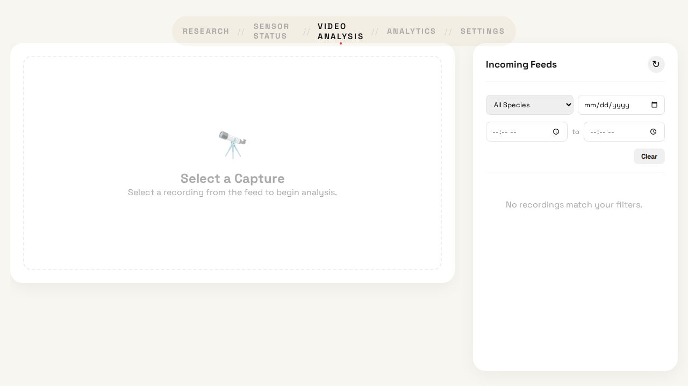
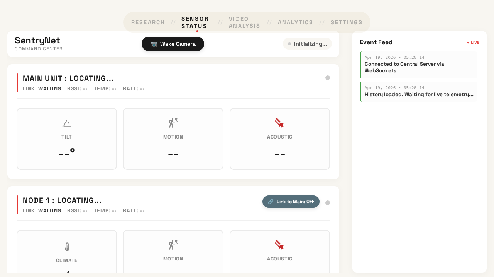

# Intelligent Wildlife Monitoring System

This project integrates Google’s SpeciesNet for wildlife classification with a  weapon detection model (ONNX Runtime) and a real-time MQTT sensor dashboard to monitor remote field cameras, detect threats, and trigger instant Telegram alerts.

## Features
* **AI Image & Video Analysis:** Real-time local inference using  SpeciesNet for wildlife classification and weapon detection for identifying armed threats.
* **Hybrid GPU–CPU Architecture:** Wildlife classification runs on NVIDIA RTX GPUs via PyTorch (CUDA), while weapon detection operates on the CPU using ONNX Runtime for efficient asymmetric processing.
* **IoT Sensor Dashboard:** Real-time monitoring of remote field units (Motion, Tilt, Gunshot, and System Status) through an MQTT broker with live device health tracking.
* **Telegram Alerts:** Automated push notifications with species name, confidence score, timestamps, and threat classification , including cooldown logic to prevent alert spam.

---


## Screenshots




## 1. Prerequisites
Before installing, ensure your Windows machine has the following:
* **Python 3.10.11:** [Download Python](https://www.python.org/downloads/) (Make sure to check "Add Python to PATH" during installation).
* **NVIDIA GPU Drivers:** Required for hardware acceleration.
* **Eclipse Mosquitto:** [Download Mosquitto for Windows](https://mosquitto.org/download/). This is the MQTT broker that allows your ESP32 to talk to the Python server. Install it and ensure the "Mosquitto Broker" service is running in Windows Services.
---
*(Note: You must add the following at the end of the mosquitto.conf file:
listener 1883 0.0.0.0
allow_anonymous true)*

## 2. Project Setup

### Quick Setup (Recommended)

You can use the provided setup script to automatically create your virtual environment, install dependencies, and run diagnostic checks:

```bash
# On Linux/macOS
./setup.sh

# On Windows (Git Bash or similar)
bash setup.sh
```

*(Note: Once installed, you will still need to run `source venv/bin/activate` or `.\venv\Scripts\activate` every time you open a new terminal to work on this project).*

<details>
<summary><b>Manual Setup (Click to expand)</b></summary>

### Set Up the Virtual Environment

Keep your dependencies isolated by creating a virtual environment:

```powershell
py -3.10 -m venv venv
.\venv\Scripts\activate

```

### Install `requirements.txt` and CUDA 11.8

NVIDIA GPU (CUDA 11.8)
```powershell
pip install torch torchvision --index-url https://download.pytorch.org/whl/cu118

```
Install everything by running:

```powershell
pip install -r requirements.txt
```
</details>

---

## 3. Install the AI Model (Crucial Step)

The SpeciesNet AI model is a ~200MB file that must be downloaded.

1. Go to Kaggle: [SpeciesNet v4.0.2a PyTorch Model](https://www.kaggle.com/api/v1/models/google/speciesnet/pyTorch/v4.0.2a/1/download)
2. Download the `archive.tar.gz` file and extract it.
3. Open the extracted folder. **Move all of its contents** directly into your project's `speciesnet_model/` folder.
* ⚠️ **Rule:** The file `info.json` MUST be located exactly at `WildlifeProject\speciesnet_model\info.json`. Do not leave it nested inside an "archive" subfolder.


---

## 4. Environment Variable Setup (.env Configuration)

Create a hidden environment file to securely store your API keys.

1. Create a file named exactly **`.env`** in your main project folder.
2. Add your credentials to the file:

```env
TELEGRAM_BOT_TOKEN=your_bot_token_here
TELEGRAM_CHAT_ID=your_chat_id_here
ROBOFLOW_API_KEY=your_api_key
```

---

## 5. Project Directory Structure

Before running the server, verify your project folder looks exactly like this:

```text
WildlifeProject/
│
├── app.py                      # Main backend server & AI logic
├── requirements.txt            # Python dependencies list
├── .env                        # Hidden file for Telegram API keys
├── species_data.db             # SQLite database for detection history
│
├── speciesnet_model/           # The downloaded Kaggle AI model
│   ├── always_crop_... .pt     # PyTorch model weights
│   └── info.json               # Model configuration
│
├── templates/                  # Frontend HTML UI
│   ├── index.html
│   ├── sensor.html
│   └── amb82_dashboard.html
│
├── static/
│   └── detections/             # Where AI-cropped animal images are saved
│
├── uploads/
│   └── videos/                 # Temporary storage for video processing
│
├── temp_inference/
│   └── frames/                 # Temporary frame extraction folder
│
└── venv/                       # Virtual environment 

```

---

## 6. Running the Server

1. Ensure your Mosquitto MQTT broker is running in the background at port:1883 and host:127.0.0.1
2. Open your terminal, activate your virtual environment, and run:
```powershell
python app.py

```


3. **Wait for Warmup:** The first time you launch, it will take 1-3 minutes to load the PyTorch model into your GPU's VRAM. Wait until you see `🌐 LOCAL URL: http://127.0.0.1:5000` in the console.
4. Open your web browser and navigate to:
* **Dashboard:** `http://127.0.0.1:5000/field_unit`


---

## Troubleshooting

* **Server is running, but the browser says "Site cannot be reached" (HTTP 404/Refused):**
Windows Defender Firewall is likely blocking Python. Restart the server and check BOTH "Private" and "Public" networks on the Windows Defender.
* **Model Load Error: `No such file or directory 'info.json'`:**
Your Kaggle model files are extracted into a subfolder. Move them out of the `archive` folder directly into `speciesnet_model`.
* **MQTT Connection Error:**
Ensure Mosquitto is installed and the Windows Service is actively running. The script attempts to connect to `127.0.0.1` on port `1883`.


```
